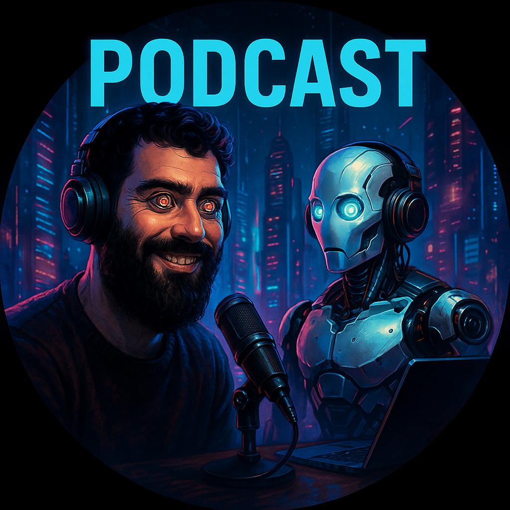

    preview do podcast

    <audio src="output/podcast_editado.MP3" controls title="Podcast editado"></audio>

# Projeto Podcast Gerado por I.A.s

 > Este projeto é um desafio da DIO referente ao bootcamp "Universia - Fundamentos de IA Generativa". Para mais informações, Basta acessar este link:
 > https://github.com/felipeAguiarCode/prompts-for-podcast-generate-by-ia

Projeto com o objetivo de gerar um podcast utilizando ferramentas de IA através de prompts mais trabalhado.

## 💻 Tecnologias utilizadas no projeto

- [ChatGPT](https://chat.openai.com/) 
- [ElevenLabs](https://beta.elevenlabs.io/)
- [Capcut](https://www.capcut.com/pt-br/)

## ✨ Como foi feito ?

- Roteiro gerado via chatgpt
- Audio gerado pela elevenLabs
- A imagem foi gerada pelo chatgpt
- Capcut para tratar aúdio e adicionar sons de fundo

## 📚 Materiais

- [Notion Template](https://www.notion.so/PAS-Podcast-AI-Studio-29fe4059dbe28190aeeacfc7d7fd2026)
- [Editor de aúdio](https://www.capcut.com/editor?from_page=landing_page&__action_from=picture_V%C3%ADdeos%20profissionais%20em%20minutos,%20n%C3%A3o%20em%20horas.)

## 🛠️ Instruções de execução

Utilize os prompts dentro do link do `Notion` fornecido na parte de `Materiais` para criar um podcast de maneira automatizada, para isso siga o passo a passo abaixo.

- 🤖 1. Use os prompts de roteiro no `chagpt`
- 🤖 2. Use os prompts de roteiro gerados pelo chatgpt no  `ElevenLabs`
- 🤖 3. Use os prompts de artes no `chatgpt` - Eu utilizei o chat gpt para gerar a imagem

## 👨‍💻 Expert

    
    
&nbsp&nbsp&nbspEduardo Sousa 
    &nbsp&nbsp&nbsp
    <a 
        href="https://github.com/eduares">
        GitHub
    </a>
    &nbsp;|&nbsp;
    <a 
        href="https://www.linkedin.com/in/eduardo-s-150567156/">
        LinkedIn
    </a>
    &nbsp;|&nbsp;

  

---

⌨️ com 💜 por [Eduardo Sousa](https://github.com/eduares)